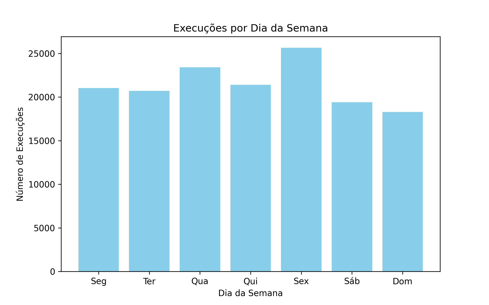

# Análise de Hábitos Musicais no Spotify  
**Projeto com Pandas + Machine Learning**  
**Dataset:** Top Spotify Songs in 73 Countries (Kaggle)

---

## Objetivo do Projeto

Explorar padrões de escuta no Spotify usando dados reais para responder perguntas como:

### 1. Quais artistas são mais escutados?

Os artistas mais escutados (quantidade de execuções):

| Artista       | Execuções |
|---------------|-----------|
| The Beatles   | 13.621    |
| The Killers   | 6.878     |
| John Mayer    | 4.855     |
| Bob Dylan     | 3.814     |
| Paul McCartney| 2.697     |

---

## 2. Quais músicas são ouvidas por mais tempo?

| Música                                                              | Tempo Total (ms) | Tempo Total (h) |
|--------------------------------------------------------------------|-----------------|----------------|
| Ode To The Mets                                                     | 67431580        | 18.73          |
| The Return of the King (feat. Sir James Galway, Viggo Mortensen…)  | 64401661        | 17.89          |
| The Fellowship Reunited (feat. Sir James Galway, Viggo Mortensen…) | 44756730        | 12.43          |
| 19 Dias y 500 Noches - En Directo                                  | 42914042        | 11.92          |
| In the Blood                                                        | 38427087        | 10.68          |

---

### 3. Quais músicas são mais puladas?

| Música                    Taxa de Pulagem |
|--------------------------|-----------------|
| Ámame                    | 100%            |
| Your Flesh Is So Nice    | 100%            |
| Younger                  | 100%            |
| Young Again - Radio Edit | 100%            |
| Young & Set              | 100%            |

*Taxa de pulos calculada como: (número de pulos da música) ÷ (total de execuções da música).*

---

### 4. Qual plataforma é mais usada para ouvir música?

| Plataforma       | Execuções |
|-----------------|-----------|
| android          | 139821    |
| cast to device   | 3898      |
| ios              | 3049      |
| windows          | 1691      |
| mac              | 1176      |
| web player       | 225       |

### 5. Como o comportamento muda durante os dias ou horários? (crie um grafico)

Abaixo, o número de execuções por dia da semana.  
O gráfico mostra que o dia com mais execuções foi a Sexta-feira (Sex) e o menor foi o domingo (Dom).

### 6. Quantas execuções ocorrem em modo aleatório (shuffle)?

| Execuções | porcentagem |
|-----------------|-------|
| 111.583   |   74,44%     |

Interpretação:
A maioria das execuções ocorreu em modo aleatório (shuffle), mostrando que os usuários preferem deixar o Spotify escolher a ordem das músicas, em vez de seguir a sequência padrão.

### 7. As músicas foram interrompidas por pular ou ouvidas até o fim?
As músicas mais ouvidas até o fim, ou seja, terminadas por "endplay" ou "trackdone", refletem as faixas que prenderam mais a atenção dos usuários

Música	Execuções até o fim
Ode To The Mets	180
In the Blood	150
Dying Breed	137
Caution	136
For What It's Worth	130

| Música                | Execuções até o fim |
|-----------------------|---------------------|
| Ode To The Mets       | 180                 |
| In the Blood          | 150                 |
| Dying Breed           | 137                 |
| Caution               | 136                 |
| For What It's Worth   | 130                 |

Interpretação:
Essas músicas apresentam maior retenção, o que indica engajamento sólido dos ouvintes. Elas conseguem manter a atenção, o que é valioso para estratégias de recomendação e fidelização dos usuários.

## 🧹 Etapas de Preparação dos Dados

- ✔️ Leitura dos arquivos `.csv` com Pandas  
- ✔️ Remoção da coluna `spotify_track_uri` (não será usada)  
- ✔️ Conversão da coluna `ts` para formato de data e hora (`datetime`)  
- ✔️ Criação de nova coluna com apenas a data (`data`)  
- ✔️ Criação da coluna `dia_semana` para análise por dia da semana  
- ✔️ Filtragem e preparação de colunas para análise de pulos, shuffle e término de músicas  
- ✔️ Outras etapas definidas e concluídas  

---

## 📊 Análises em Andamento

## 📈 Insights Interessantes

A forte preferência pelo modo aleatório (shuffle) mostra que os usuários buscam diversidade e uma experiência musical menos previsível.

Sexta-feira é o dia com maior número de execuções, sugerindo que o consumo de música está ligado a momentos de lazer e descontração no final da semana.

Algumas músicas apresentam taxa de pulagem de 100%, indicando pouco engajamento e potencial necessidade de revisão em recomendações e curadoria.

As faixas mais ouvidas até o fim indicam quais músicas conseguem realmente prender a atenção dos ouvintes, sendo valiosas para estratégias de retenção e recomendação.

---

## 🧠 Conclusões Finais

🟨 A análise mostrou que a maioria dos usuários prefere escutar músicas no modo aleatório, indicando busca por variedade. O pico de execuções às sextas-feiras reflete hábitos sociais de lazer. Músicas com alta taxa de pulos têm menor engajamento, enquanto as mais finalizadas mantêm a atenção dos ouvintes. Esses insights são úteis para melhorar recomendações e aumentar a satisfação dos usuários no Spotify.

---

## 🛠️ Ferramentas Usadas

- Python + Pandas  
- VS Code  
- Dataset do Kaggle  

